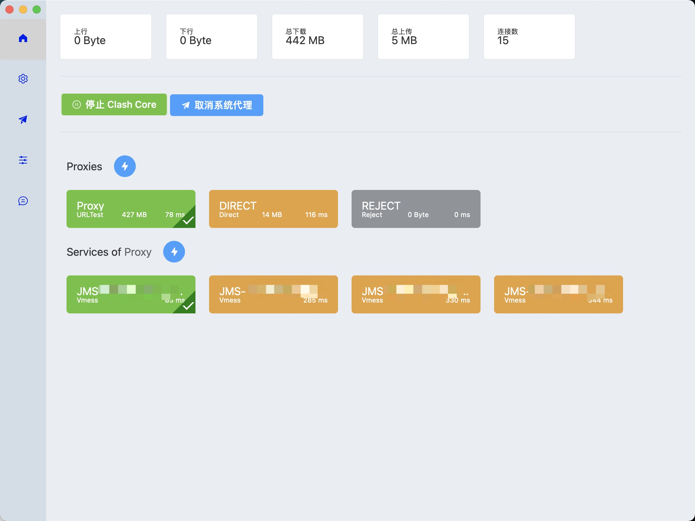
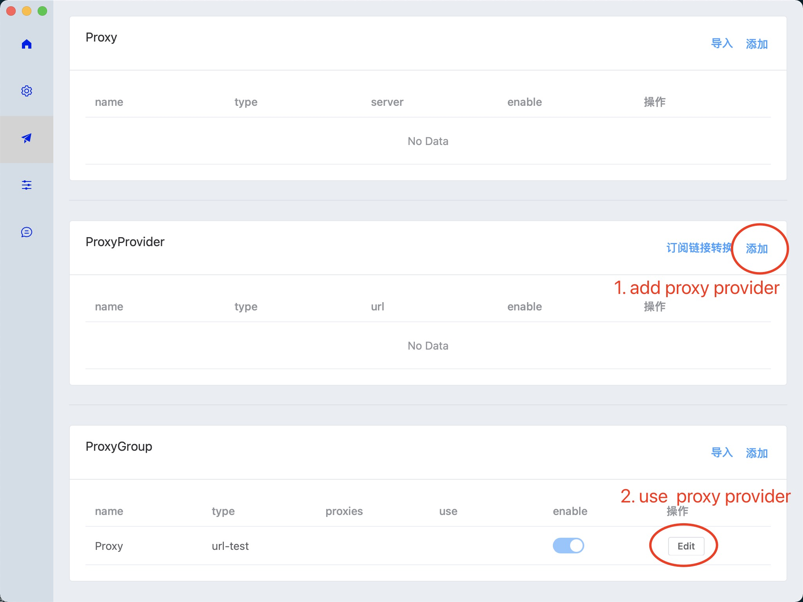
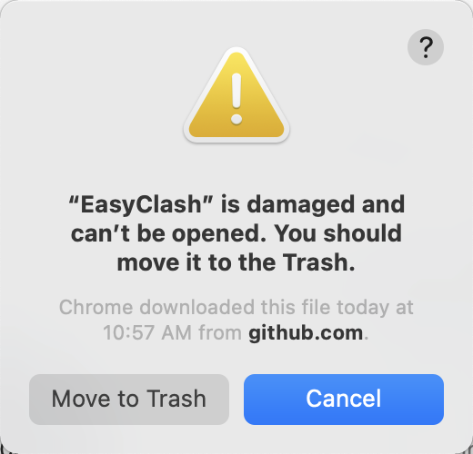

# EasyClash

An easy-to-use GUI for [clash](https://github.com/Dreamacro/clash) / [Clash.Meta](https://github.com/MetaCubeX/Clash.Meta).

Supported: 
- `Macos Intel(amd)/M1(arm)`, 
- `Windows arm/amd`
- `Linux (in process)`

[Donwload](https://github.com/daodao97/EasyClash/releases)

## Preview



## Add ProxyProvider




## QA



```shell
sudo xattr -r -d com.apple.quarantine /Applications/EasyClash.app
```

```shell
# 1
sudo spctl --master-disable

# 2
系统偏好设置 > 安全性与隐私 > 任何来源
```
